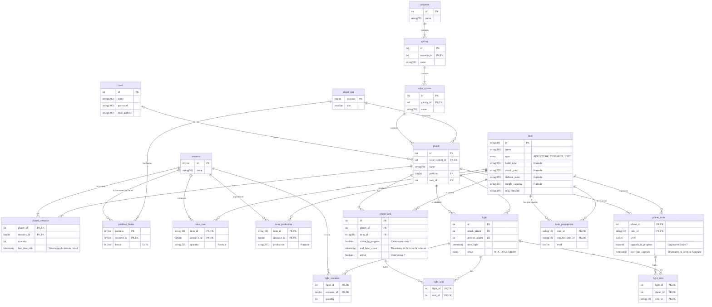

```mermaid
%%{init: {'theme': 'base', 'themeVariables': { 'primaryColor': '#e9e6fc', 'fontFamily': 'Quicksand', 'fontSize': '16px'}}}%%

erDiagram
  user |o--o{ planet :owns
  user {
    int id PK
    string(100) name
    string(100) password
    string(100) mail_address
  }

  universe ||--|{ galaxy :contains
  universe {
    int id PK
    string(50) name
  }

  galaxy ||--|{ solar_system :contains
  galaxy {
    int id PK
    int universe_id PK, FK
    string(50) name
  }

  solar_system ||--|{ planet :contains
  solar_system {
    int id PK
    int galaxy_id PK, FK
    string(50) name
  }

  resource ||--|{ planet_resource :"is present"
  resource ||--o{ position_bonus :"is concerned by bonus"
  resource ||--o{ item_cost :"composes"
  resource ||--o{ item_production :"is produced"
  resource ||--o{ fight_resource:"is won"
  resource {
    tinyint id PK
    string(50) name
  }

  planet_size ||--o{ planet :measures
  planet_size ||--o{ position_bonus :"has bonus"
  planet_size {
    tinyint position PK
    smallint size
  }

  position_bonus {
    tinyint position PK 
    tinyint resource_id PK, FK
    tinyint bonus "En %"
  }

  planet ||--|{ planet_resource :has
  planet ||--|{ planet_item :has
  planet ||--o{ planet_unit :has
  planet ||--o{ fight :"is attacked"
  planet ||--o{ fight :"attacks"
  planet {
    int id PK
    int solar_system_id PK, FK
    string(50) name
    tinyint position FK
    int user_id FK
  }

  item ||--o{ item_cost :costs
  item ||--o{ item_production :produces
  item ||--o{ item_prerequisite :"has prerequisite"
  item ||--o{ item_prerequisite :"is required"
  item ||--o{ planet_item :"is present"
  item ||--o{ planet_unit :"is present"
  item {
    string(10) id PK
    string(100) name 
    enum type "STRUCTURE, RESEARCH, UNIT"
    string(255) build_time "Formule"
    string(255) attack_point "Formule"
    string(255) defense_point "Formule"
    string(255) freight_capacity "Formule"
    string(100) img_filename
  }

  item_cost { 
    string(10) item_id PK, FK
    tinyint resource_id PK, FK
    string(255) quantity "Formule"
  }

  item_prerequisite {
    string(10) item_id PK, FK
    string(10) required_item_id PK, FK
    tinyint level
  }

  item_production {
    string(10) item_id PK, FK
    tinyint resource_id PK, FK
    string(255) production "Formule" 
  }

  planet_resource {
    int planet_id PK, FK
    tinyint resource_id PK, FK
    int quantity
    timestamp last_time_calc "Timestamp du dernier calcul"
  }

  planet_item ||--o{ fight_item :fights
  planet_item {
    int planet_id PK, FK
    string(10) item_id PK, FK
    tinyint level
    boolean upgrade_in_progress "Upgrade en cours ?"
    timestamp end_time_upgrade "Timestamp de la fin de l'upgrade"
  }

  planet_unit ||--o{ fight_unit :fights
  planet_unit {
    int id PK
    int planet_id FK
    string(10) item_id FK
    boolean create_in_progress "Création en cours ?"
    timestamp end_time_create "Timestamp de la fin de la création"
    boolean active "Unité active ?"
  }

  fight ||--o{ fight_item :has
  fight ||--o{ fight_unit :has
  fight ||--o{ fight_resource :has
  fight {
    int id PK
    int attack_planet FK
    int defense_planet FK
    timestamp time_fight
    eunm result "WIN, LOSE, DRAW"
  }

  fight_item {
    int fight_id PK, FK
    int planet_id PK, FK
    string(10) item_id PK, FK
  }

  fight_unit {
    int fight_id PK, FK
    int unit_id PK, FK
  }

  fight_resource {
    int fight_id PK, FK
    tinyint resource_id PK, FK
    int quantity
  }
```